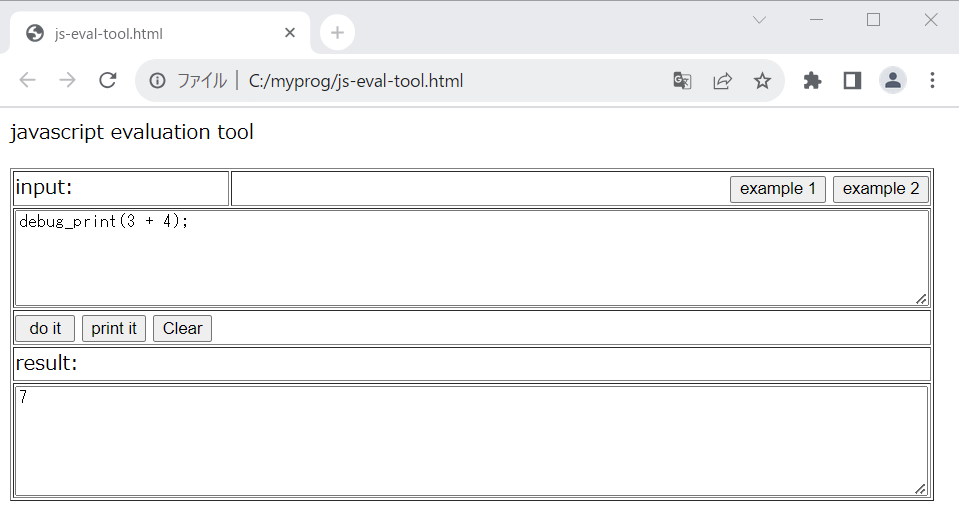

# javascript-eval-tool
A easy javascript evaluation tool on web-browser.

### usage
 - Download the html file to your local machine.
 - Open it with web browser
 - Write javascript code into the upper text-area.
 - Click "do it" button to execute it, or "print it" to evaluate code and to know return value.

### Note
 - example 1 and 2 button will insert(overwrite) example code into input area.
 - "debug_print(value)" and "debug_println(value)" function available.
 